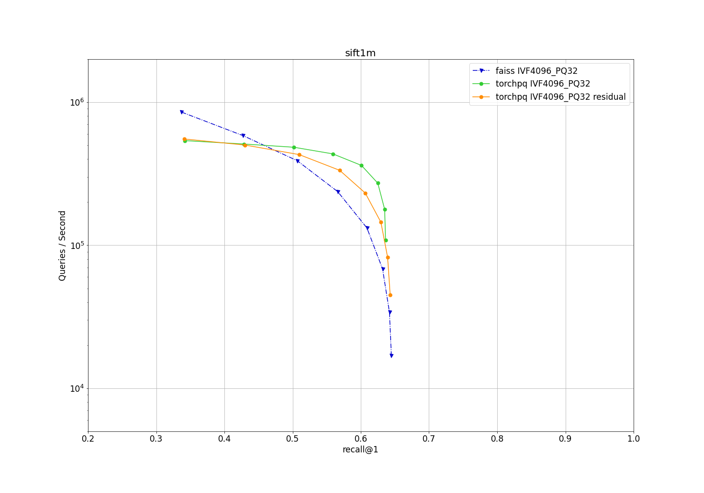
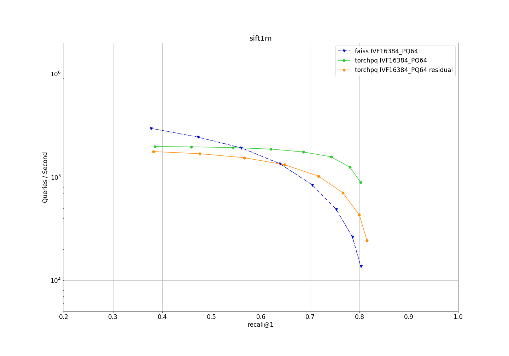
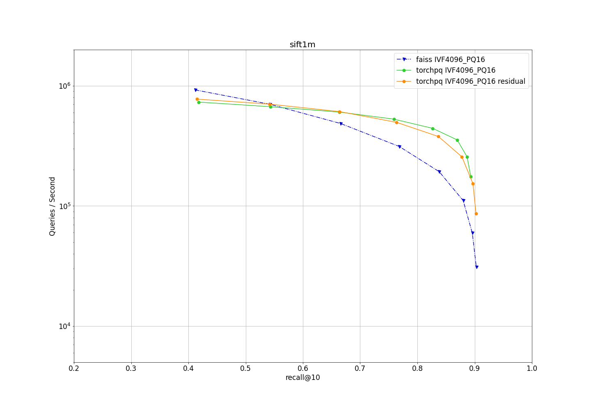
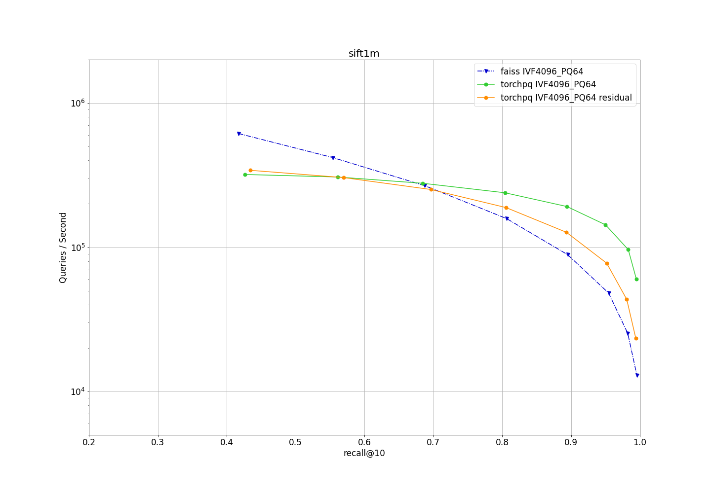
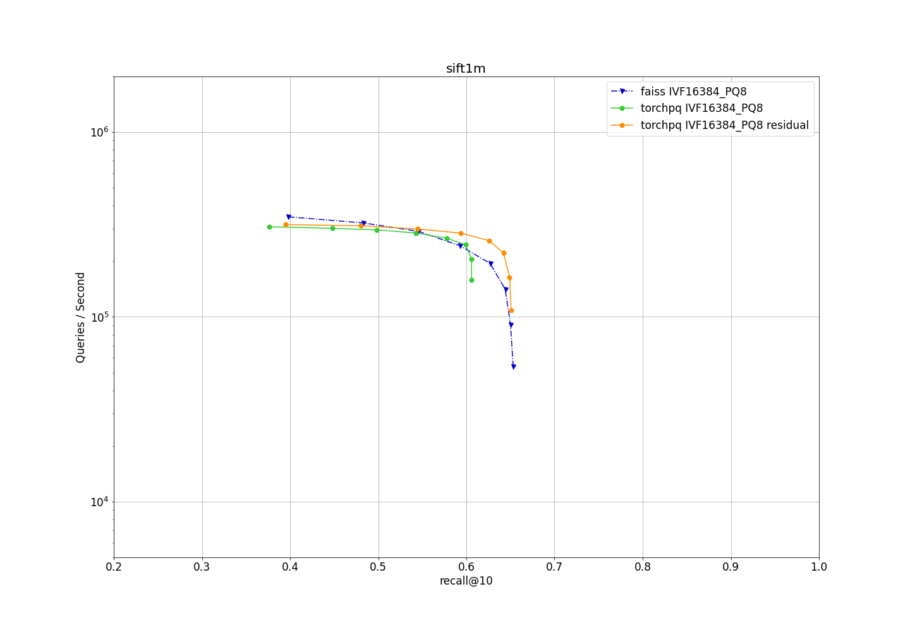
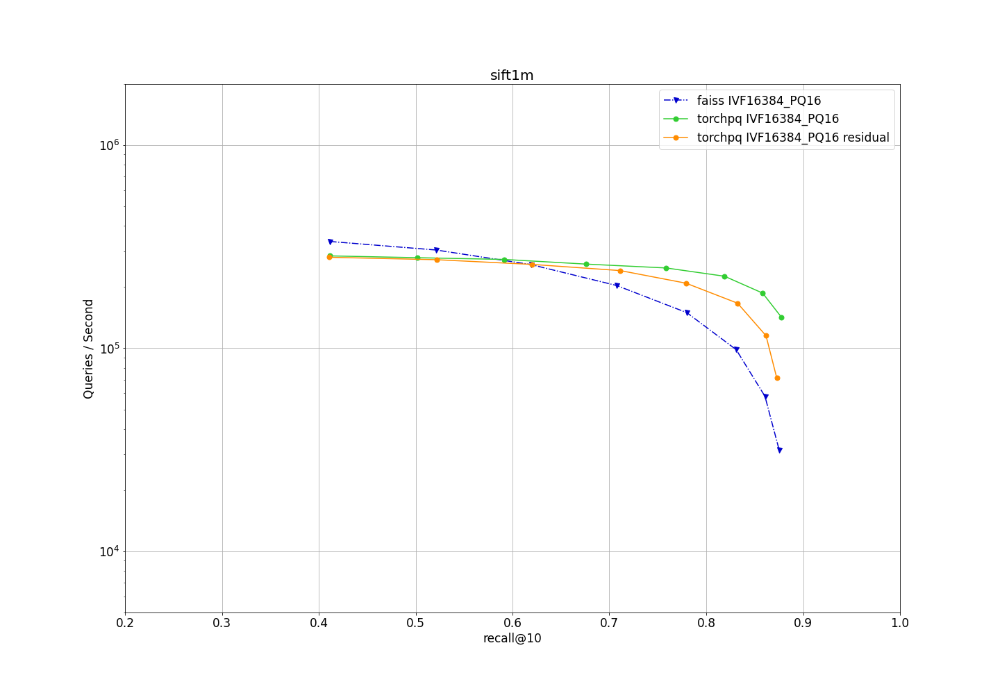
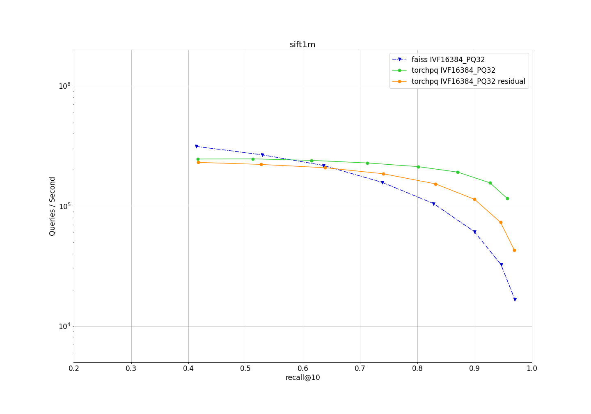
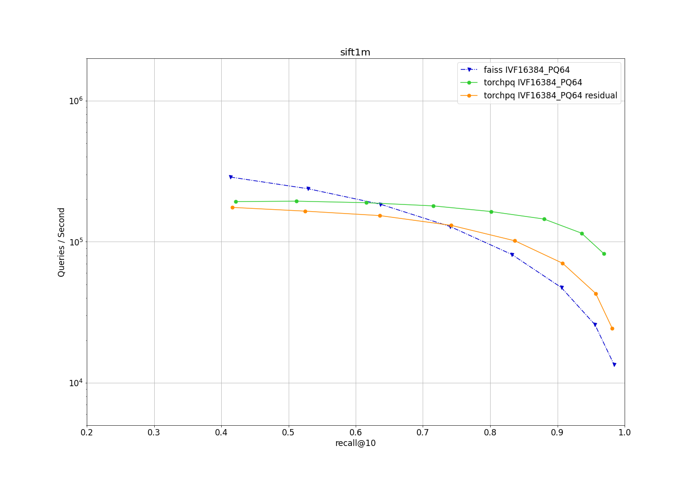

# Benchmark

## How to read the plots
- the plot format follows the style of [ann-benchmarks](http://ann-benchmarks.com/)
- X axis is recall@k, Y axis is queries/second
- for the same recall@k, closer to topside edge is better
- for the same queries/second, closer to the right side edge is better
- each node on a curve represents a different `n_probe`, starting from 1 at the left most node, and multiplied by 2 at every next node. (n_probe = 1,2,4,8,16,32,64,128)  

## Dataset: Sift1M
- number of training vectors: 100,000
- number of base vectors: 1,000,000
- number of query vectors: 10,000
- vector dimentions: 128

### Test device: 1 x Tesla T4 (Turing)

#### k = 1

  

    <b>Click here to see details:</b>  
  
  

##### IVF4096 PQ8
  

##### IVF4096 PQ16
  

##### IVF4096 PQ32
  

##### IVF4096 PQ64
  

##### IVF16384 PQ8
  

##### IVF16384 PQ16
  

##### IVF16384 PQ32
  

##### IVF16384 PQ64
  

#### k = 10

  

    <b>Click here to see details:</b>  
  
  

##### IVF4096 PQ8
  

##### IVF4096 PQ16
  

##### IVF4096 PQ32
  

##### IVF4096 PQ64
  

##### IVF16384 PQ8
  

##### IVF16384 PQ16
  

##### IVF16384 PQ32
  

##### IVF16384 PQ64
  

